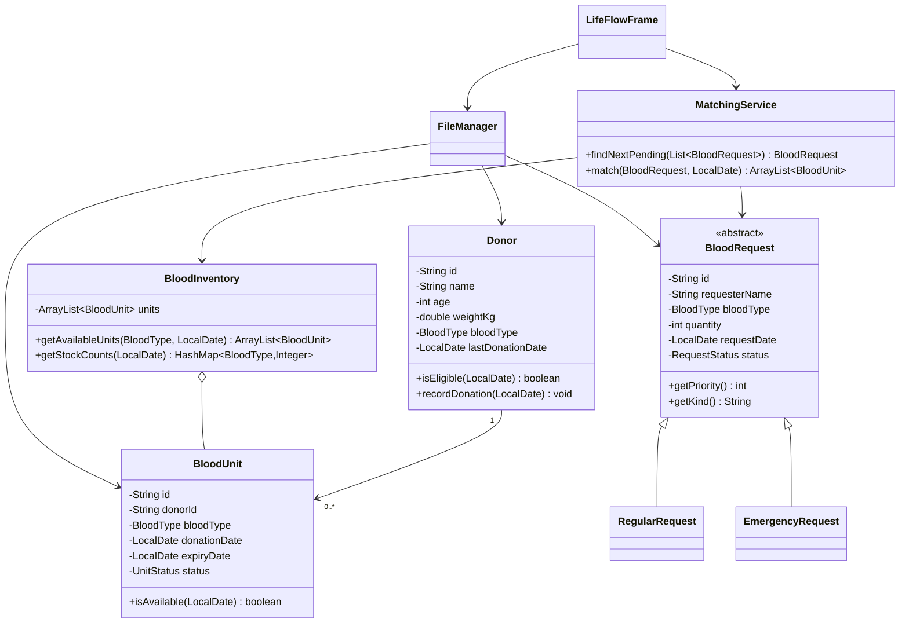

# LifeFlow Architecture

## Design goal

Keep the implementation simple enough for every team member to explain while
demonstrating the required object-oriented concepts through real behaviour.

## Package responsibilities

- `lifeflow.model`: state and single-object rules.
- `lifeflow.service`: inventory queries and cross-object matching.
- `lifeflow.persistence`: text-file mapping only.
- `lifeflow.ui`: Swing input, tables, messages, and orchestration.
- `lifeflow.Main`: application start-up and data loading.

## UML class diagram



## Main data flow

```text
Text files -> FileManager -> ArrayLists/BloodInventory -> Swing tables
Swing form -> model validation -> service simulation -> updated collections
Updated collections -> FileManager -> text files
```

## Persistence schemas

```text
donors.txt
id|name|age|weightKg|bloodType|lastDonationDate

blood_units.txt
id|donorId|bloodType|donationDate|expiryDate|status

requests.txt
id|kind|requesterName|bloodType|quantity|requestDate|status
```

Dates use `yyyy-MM-dd`. Missing files represent empty collections. A malformed
line stops start-up and reports its file and line number to prevent silent data
loss.
