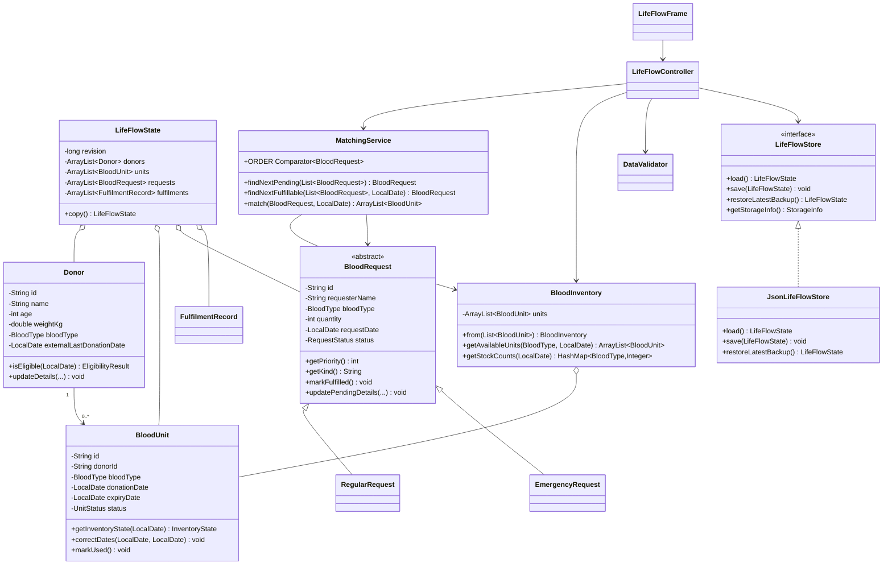

# LifeFlow Architecture

## Design goal

Keep the implementation simple enough for every team member to explain while
demonstrating the required object-oriented concepts through real behaviour.

## Package responsibilities

- `lifeflow.model`: state aggregate, single-object rules, and result types.
- `lifeflow.service`: inventory queries, matching, validation, and UI-facing operations.
- `lifeflow.persistence`: JSON mapping with integrity checks and automatic backup.
- `lifeflow.ui`: dashboard, sidebar navigation, data pages, dialogs, and theming.
- `lifeflow.Main`: application start-up and data loading.

## UML class diagram



## Main data flow

```text
lifeflow.json -> JsonLifeFlowStore -> LifeFlowState -> LifeFlowController -> panels
Swing dialog -> controller validation -> model/service operation
Updated state -> JsonLifeFlowStore -> lifeflow.json + dated backup
```

## UI composition

`LifeFlowFrame` contains the fixed sidebar, a `CardLayout`, and the temporary
status bar. `DashboardPanel` shows live counts, blood-group availability, quick
actions, and the next pending and next fulfilable requests. Donors, inventory,
requests, and matching each use a focused panel, while `UiTheme` and
`UiComponents` keep colors, typography, buttons, cards, tables, and status
badges consistent. `PageShell` and `BoundedContentPanel` keep every page on a
shared centered layout.

## Persistence schema

`JsonLifeFlowStore` writes a single `lifeflow.json` envelope:

```text
{
  "formatVersion": 2,
  "revision": <long>,
  "savedAt": <ISO timestamp>,
  "checksum": <SHA-256 of checksum content>,
  "data": {
    "donors": [...],
    "bloodUnits": [...],
    "requests": [...],
    "fulfilments": [...]
  }
}
```

The checksum covers the format version, revision, and data payload; a mismatch
is treated as corruption. Every save also writes a timestamped backup file, and
`restoreLatestBackup()` recovers the newest valid copy when the main file is
corrupt. Format version 1 files are migrated transparently on load. Any corrupt
content is surfaced as a clean `IOException` with the offending file name rather
than a crash. Dates use `yyyy-MM-dd`, and missing or empty files represent empty
collections.