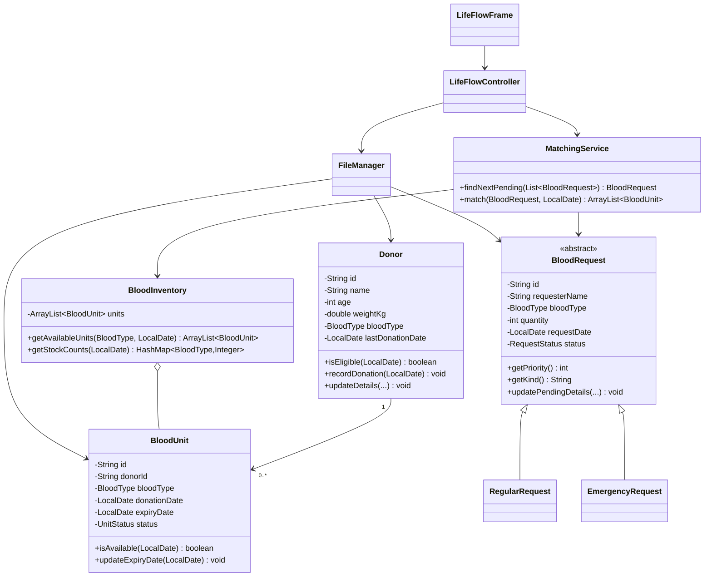

# LifeFlow Architecture

## Design goal

Keep the implementation simple enough for every team member to explain while
demonstrating the required object-oriented concepts through real behaviour.

## Package responsibilities

- `lifeflow.model`: state and single-object rules.
- `lifeflow.service`: inventory queries, matching, validation, and UI-facing operations.
- `lifeflow.persistence`: text-file mapping only.
- `lifeflow.ui`: dashboard, sidebar navigation, data pages, dialogs, and theming.
- `lifeflow.Main`: application start-up and data loading.

## UML class diagram



## Main data flow

```text
Text files -> FileManager -> LifeFlowController -> dashboard and tables
Swing dialog -> controller validation -> model/service operation
Updated collections -> FileManager -> text files -> refresh all five screens
```

## UI composition

`LifeFlowFrame` contains the fixed sidebar, a `CardLayout`, and the temporary
status bar. `DashboardPanel` shows live counts, blood-group availability, quick
actions, and the next priority request. Donors, inventory, requests, and
matching each use a focused panel, while `UiTheme` and `UiComponents` keep
colors, typography, buttons, cards, tables, and status badges consistent.

## Persistence schemas

```text
donors.txt
id|name|age|weightKg|bloodType|lastDonationDate

blood_units.txt
id|donorId|bloodType|donationDate|expiryDate|status

requests.txt
id|kind|requesterName|bloodType|quantity|requestDate|status
```

Dates use `yyyy-MM-dd`. Missing files represent empty collections. A malformed
line stops start-up and reports its file and line number to prevent silent data
loss.
